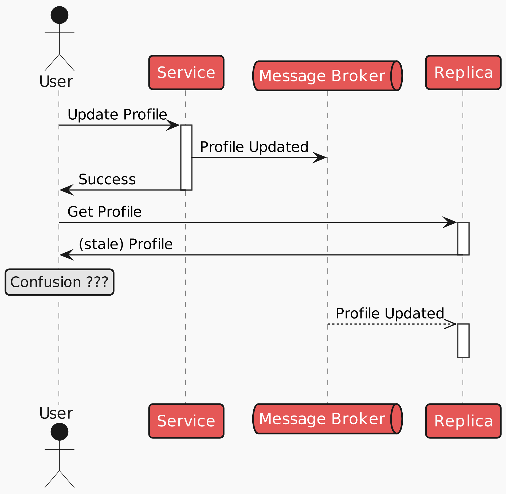
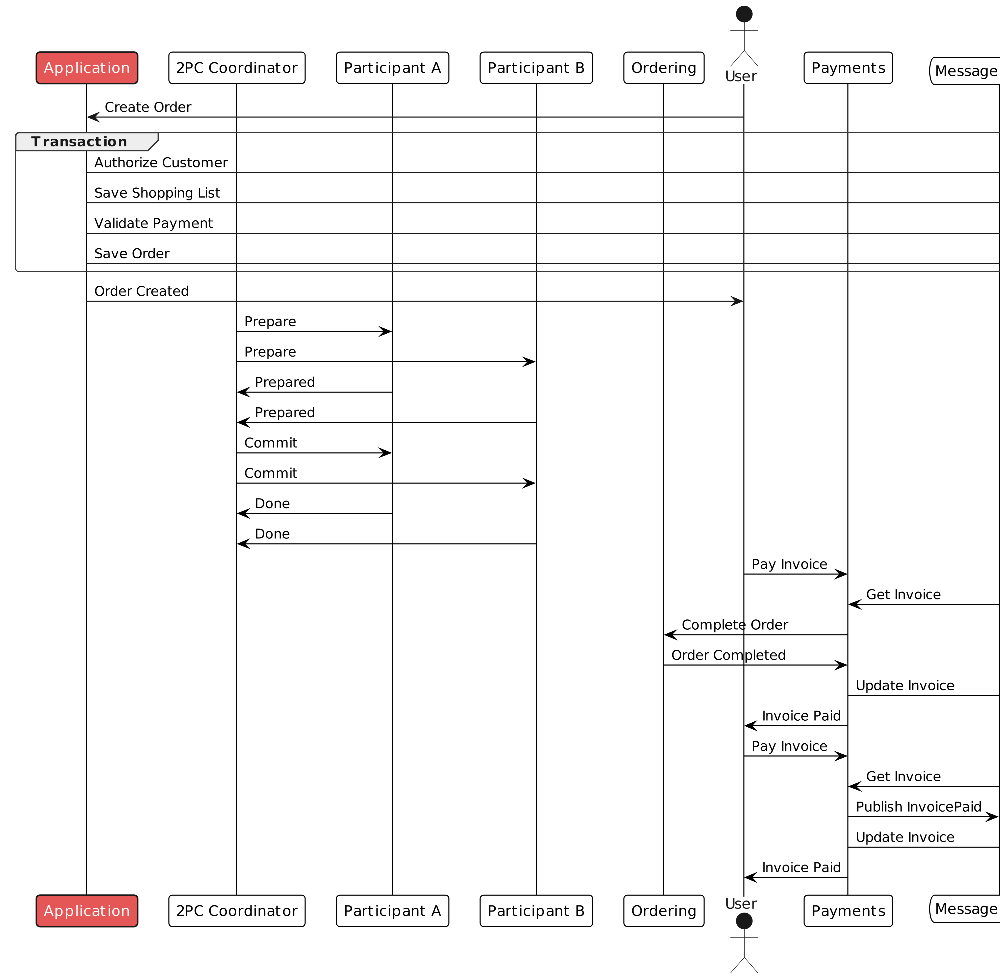
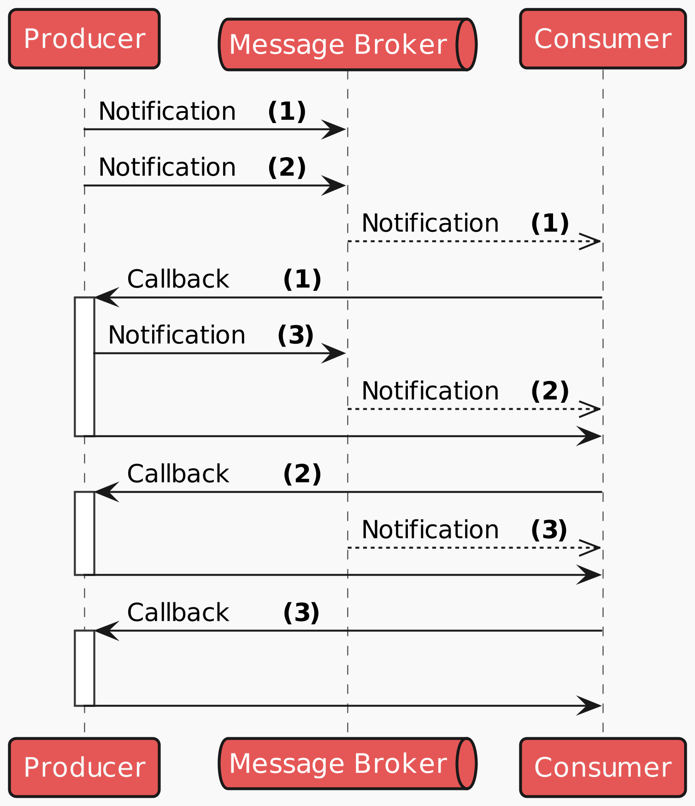
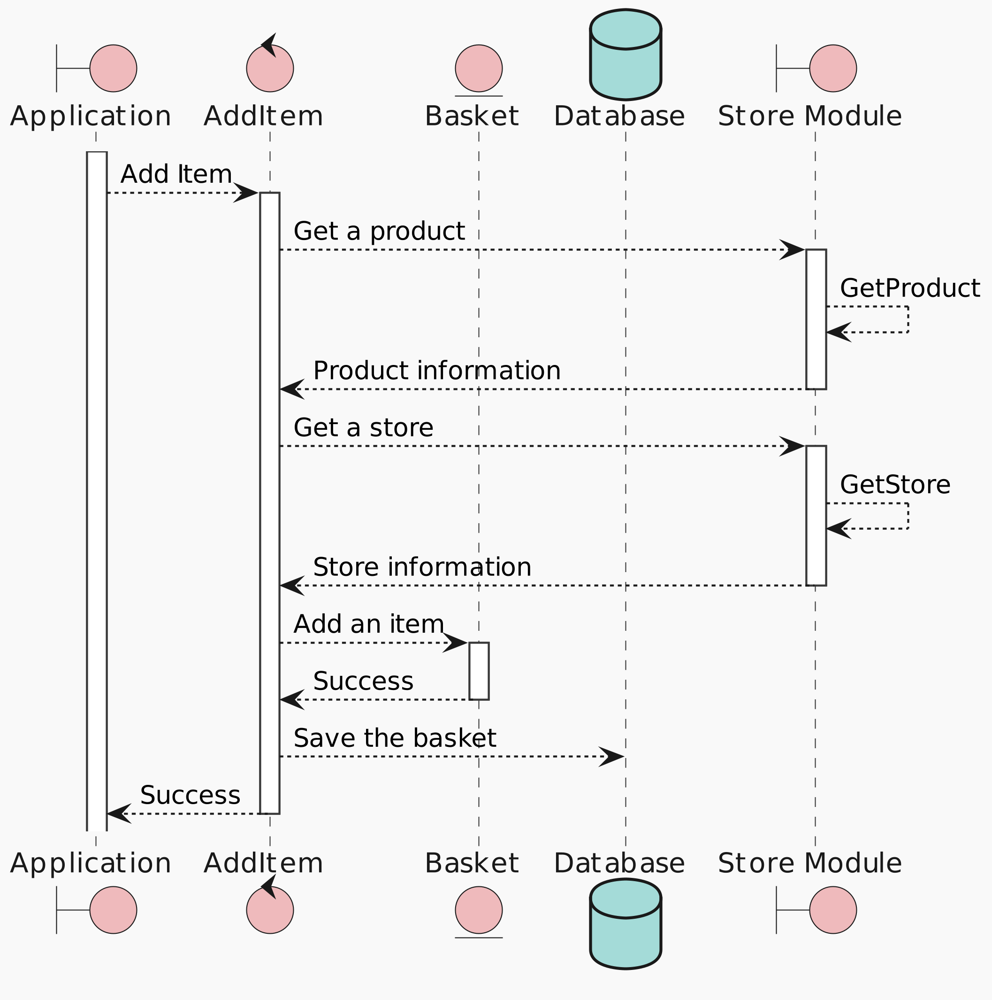
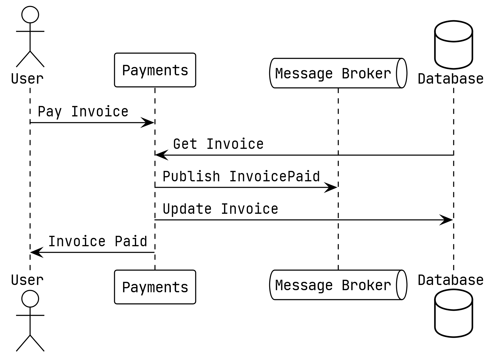
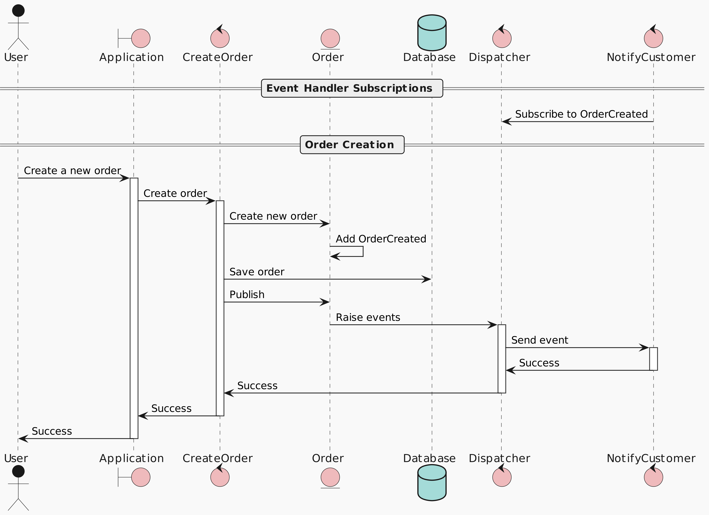
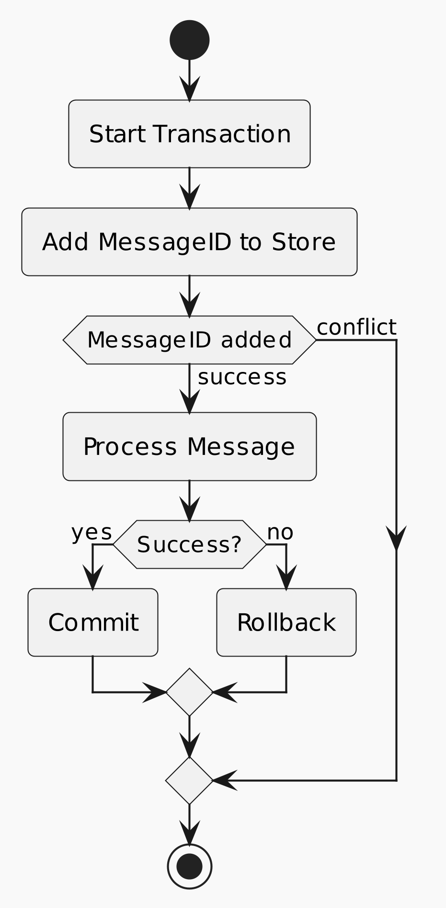

# Intelli-Mall

## High-level view of the components


## Tree Structure of IntelliMall

[Tree Structure](docs/ADL/0003-structure-of-intellimall.md)

## Intelli-Mall AWS Architecture


## How to start the application

Starting the monolith:

```bash
docker compose --profile monolith up
```

Starting the microservices

```bash
docker compose --profile microservices up  
```

> Note: my local machine is Mac M2 ARM64, be sure to locate the docker image with the tag version compatible with your machine architecture.

## Docker Compose with either a monolith or microservices


## Swagger UI


## The monitoring services


## Use `/cmd/busywork` to simulate several users making requests to perform several different activities:

```bash
cd cmd/busywork
go run .
```

### Busywork Output

```bash
07:55:36.221473 [Client 1] is considering adding new inventory
07:55:36.687106 [Client 3] is considering registering a new account
07:55:37.281486 [Client 1] is adding "Refined Wooden Computer" for $6.76
07:55:38.797600 [Client 1] is adding "Oriental Granite Keyboard" for $8.81
07:55:39.115718 [Client 2] is considering registering a new account
07:55:40.790283 [Client 1] is adding "Unbranded Steel Chair" for $8.65
07:55:40.797666 [Client 1] is done adding new inventory
07:55:42.595664 [Client 4] is considering adding new inventory
07:55:43.460873 [Client 4] is adding "Rustic Rubber Fish" for $9.26
07:55:44.069827 [Client 4] is adding "Licensed Frozen Pants" for $11.21
07:55:45.709748 [Client 5] is considering browsing for new things
07:55:45.721676 [Client 4] is adding "Practical Metal Towels" for $6.27
07:55:45.729938 [Client 4] is done adding new inventory
07:55:46.598130 [Client 3] is considering adding new inventory
07:55:47.884613 [Client 5] is browsing the items from "William Connelly"
07:55:48.285565 [Client 3] is adding "Incredible Granite Chips" for $10.04
07:55:49.448966 [Client 3] is adding "Handmade Bronze Chicken" for $6.83
07:55:49.651385 [Client 5] might buy 3 "Rustic Concrete Pants" for $7.37 each
07:55:50.290852 [Client 5] thinks $22.11 is too much
07:55:50.297213 [Client 5] Quitting time
07:55:50.394300 [Client 3] is adding "Intelligent Rubber Shirt" for $10.36
07:55:50.400688 [Client 3] is done adding new inventory
07:55:50.400713 [Client 3] Quitting time
07:55:50 busywork shutdown
```

You can increase the number of clients by passing in the -clients=n flag, with an upper limit of 25.

## The Jaeger UI for tracing

Open http:// localhost:8081 in your browser to open Jaeger.


## Traces that involved the baskets service


## Viewing the monitoring data


Clicking on one of the rows in the graph will provide you with additional details. 

## The Prometheus UI

We also have the metrics to check out in Prometheus at `http://localhost:9090`


## Searching for the received messages counts for the cosec service


## Grafana UI for more compelling intepretation - Intelli Mall App Dashboard

Opening `localhost:3000/` and then browsing for dashboards will show the two dashboards that are installed under the intellimall folder.


How much activity you see in the dashboard will depend on how many clients you have running in the busywork application and the random interactions that the clients are performing.

## OpenTelemetry Collector dashboard


Details about how much work the collector is doing.

## How does Terminal reflect the events:

```bash
grafana        | logger=context traceID=00000000000000000000000000000000 userId=0 orgId=1 uname= t=2023-09-20T12:06:26.480212513Z level=info msg="Request Completed" method=POST path=/api/ds/query status=400 remote_addr=172.18.0.1 time_ms=21 duration=21.768709ms size=99 referer="http://localhost:3000/d/Pc9ixd4Vk/application?orgId=1&refresh=30s" traceID=00000000000000000000000000000000
collector      | 2023-09-20T12:13:41.244Z       info    TracesExporter  {"kind": "exporter", "data_type": "traces", "name": "logging", "#spans": 2}
grafana        | logger=live t=2023-09-20T12:18:33.088289544Z level=info msg="Initialized channel handler" channel=grafana/dashboard/uid/BKf2sowmj address=grafana/dashboard/uid/BKf2sowmj
prometheus     | ts=2023-09-20T13:04:51.975Z caller=compact.go:519 level=info component=tsdb msg="write block" mint=1695204291419 maxt=1695211200000 ulid=01HASB306VTMA1K6NRP5ZCCEQ3 duration=44.237792ms
```

## Business logic flow

### read after write



### transactions



### notification ordering



### adding items



### async pay invoice




### create order with domain events



<!-- ### deduplication flow

 -->